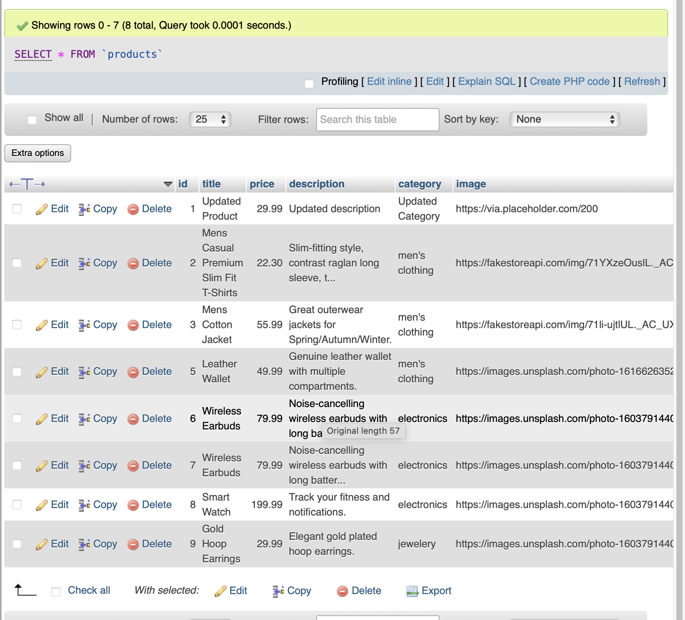
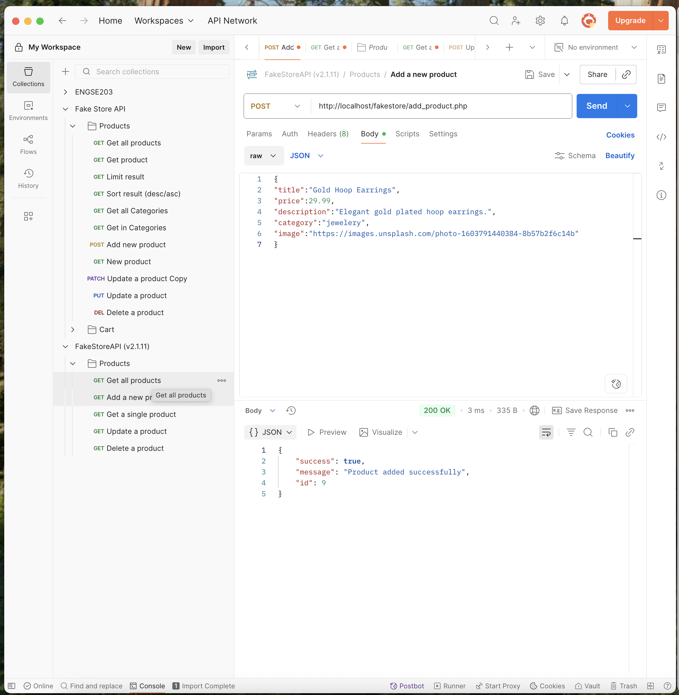
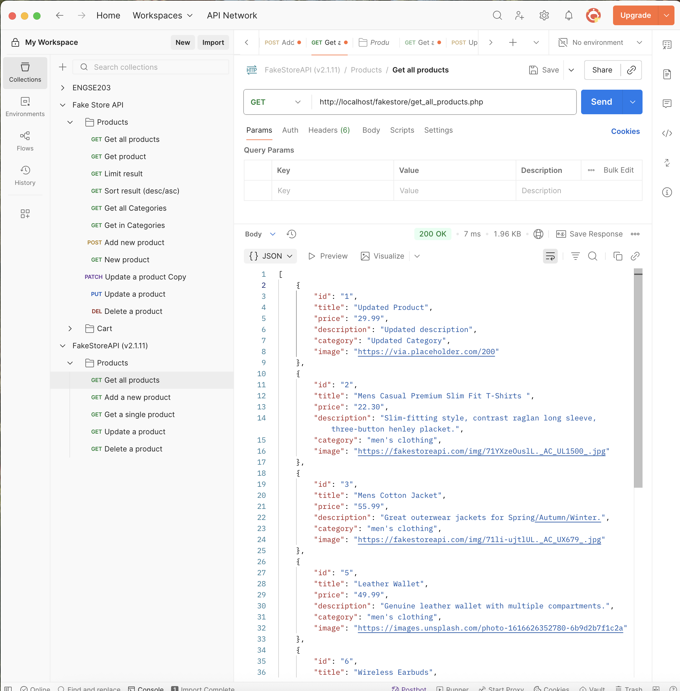
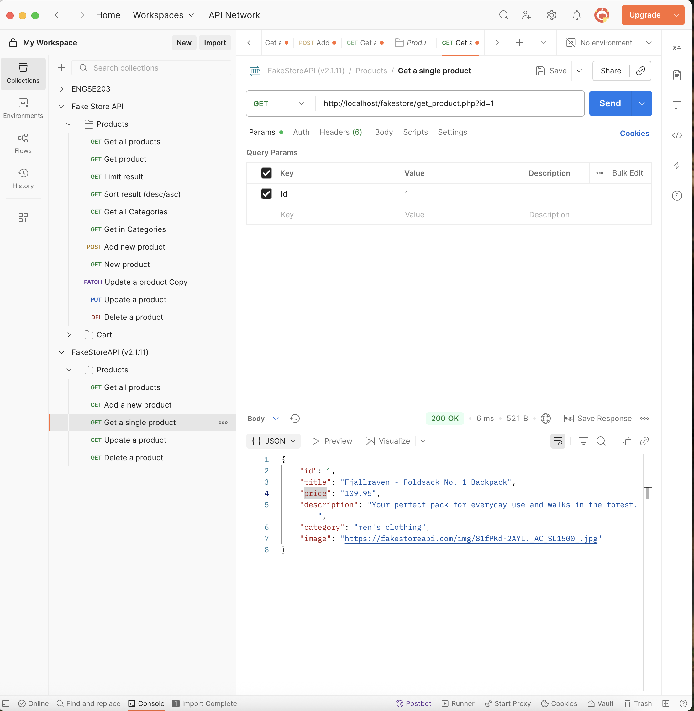
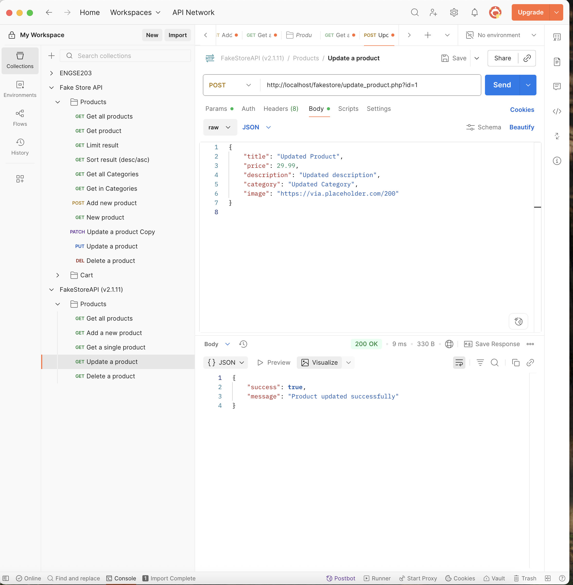
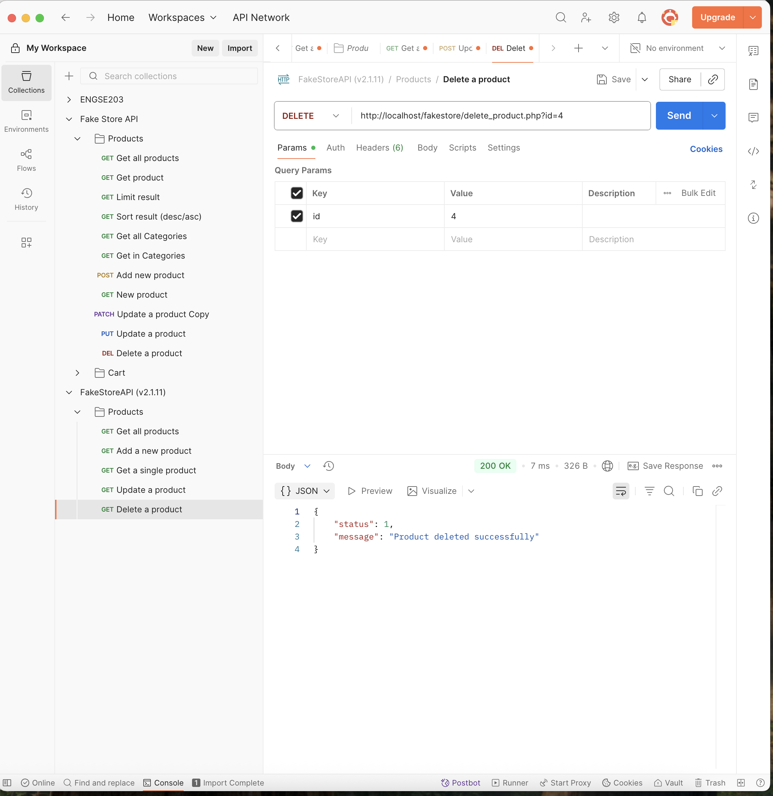

# Lab10 – Web API (Products)

### db.php → เชื่อมต่อฐานข้อมูล MySQL

### add_product.php → เพิ่มสินค้า

### get_all_products.php → ดึงสินค้าทั้งหมด

### get_product.php → ดึงสินค้าตาม ID

### update_product.php → อัปเดตสินค้า

### delete_product.php → ลบสินค้า

